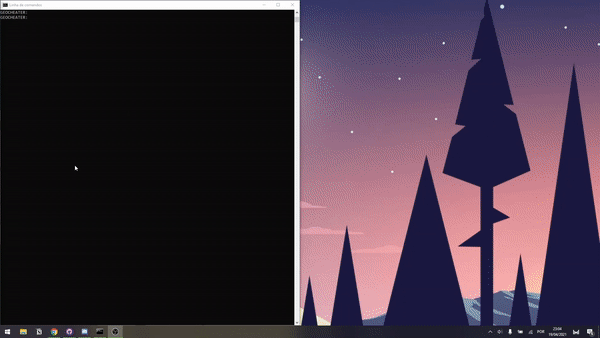

# GeoCheater
✅ A free tool that shows you the right country for GeoGuessr (even before you can choose the country)!✅




## Disclaimer
⚠️ This should not be used in online matches. The only purpose of this repository is to show an existing flaw. ⚠️


## Requirements
You **CAN'T** use:
* 🔎 Google Authentication;
* 👤 Facebook Authentication;
* 🍎 Apple Authentication. 
 
**You need normal authentication for this to work!**


## Installation
GeoCheater requires [Python 3](https://www.python.org/downloads/release/python-379/).

1. ⬇️ Clone Repository:
    ```
    git clone https://github.com/MiguelMascarenhas/GeoCheater.git
    ```

2. 📂 Go to project Folder:
    ```
    cd GeoCheater
    ```

3. 💻 Install dependencies:
    ```
    pip install -r requirements.txt
    ```

4. 🔑 Configure your credentials (in config.py):
    ```
    ############## CREDENTIALS ##############
    EMAIL = 'YOUR@MAIL.HERE'
    PASSWORD = 'YOURPASSWORD'
    ############## CREDENTIALS ##############
    ```


## Run the Cheat

1. ✅  Run the following command:
    ```
    python geocheater.py
    ```
2. ✅ The Cheat will automatically sign in with the data provided in the credentials section.

3. ✅ The Cheat will search for a 'Battle Royal - (Country Battle)' game

4. ✅ The correct Country will be displayed in the console!

5. ✅ Simply select the country!

6. 🏆 WIN!
        
